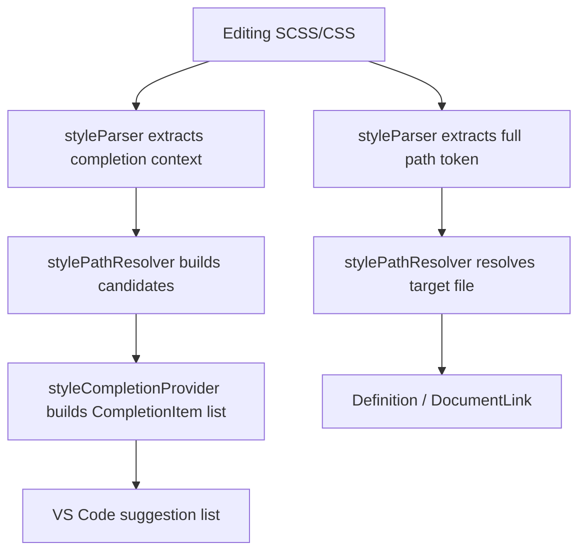

# SCSS/CSS Path IntelliSense

A VS Code extension for `.scss` and `.css` files that provides:

- Go to Definition for style import paths
- Clickable Document Links for style paths
- Alias-based path auto-completion (similar to path-intellisense)

Language:

- English: current document
- 中文: [README.zh-CN.md](README.zh-CN.md)

## Feature Overview

| Capability | Description |
| --- | --- |
| Go to Definition | Use `F12` / `Ctrl+Click` on a style path to jump to the target file |
| Document Links | Render path strings as clickable links |
| Path Completion | Suggest path candidates while typing, including incomplete strings |
| Alias Resolution | Read `baseUrl` + `paths` from the nearest `tsconfig.json` / `jsconfig.json` |

## Supported Syntax

- `@use "..."`
- `@forward "..."`
- `@import "..."`
- `@import url(...)`
- `url(...)`

Completion also works in incomplete input scenarios, for example:

```scss
@use "@/comp
@import url(../asse
```

## Quick Start

### 1. Run from source (development)

```bash
npm install
npm run compile
```

Then run VS Code debug configuration `Run SCSS/CSS Path IntelliSense Extension`.

### 2. Use as an extension

After installation, open `.scss` / `.css` files and the extension activates automatically (`onLanguage:scss`, `onLanguage:css`).

## Configuration

Search `scssPathJump` in VS Code Settings.

| Setting | Default | Description |
| --- | --- | --- |
| `scssPathJump.enableNodeModules` | `true` | Try resolving bare package imports from `node_modules` in definition resolution |
| `scssPathJump.enableUrl` | `true` | Enable parsing and completion inside `url(...)` |
| `scssPathJump.enableDocumentLinks` | `true` | Enable clickable links for style path strings |
| `scssPathJump.enablePathCompletion` | `true` | Enable path auto-completion |
| `scssPathJump.preferExtensionless` | `true` | Prefer extensionless insertion text (for example `button` instead of `button.scss`) |
| `scssPathJump.showPartialFiles` | `true` | Show Sass partial files (for example `_button.scss`) in completion |
| `scssPathJump.completionMaxEntries` | `200` | Max completion candidates per request (minimum `20`) |
| `scssPathJump.logLevel` | `error` | Log level: `off` / `error` / `debug` |

## Usage

### Go to Definition

1. Place cursor on a style path string.
2. Run `Go to Definition` (`F12`) or `Ctrl+Click`.

Example:

```scss
@use "@/styles/theme";
@import "./mixins";
```

### Document Links

Enable `scssPathJump.enableDocumentLinks` to make style paths clickable.

### Path Auto-Completion

- Auto trigger characters: `/`, `.`, `"`, `'`, `@`
- Manual trigger: `Ctrl+Space`

Candidates are filtered by current prefix and support chained folder completion (select folder -> next suggestions continue).

## Alias Configuration Example

`tsconfig.json` / `jsconfig.json` example:

```json
{
  "compilerOptions": {
    "baseUrl": ".",
    "paths": {
      "@/*": ["src/*"],
      "~styles/*": ["src/styles/*"]
    }
  }
}
```

Usage in style files:

```scss
@use "@/styles/theme";
@forward "~styles/mixins";
```

## Resolution Strategy

### Definition / Document Link resolution order

1. Relative path (`./`, `../`)
2. Workspace-root path (`/xxx`)
3. Alias mappings from `tsconfig/jsconfig` (`paths`)
4. `baseUrl` fallback
5. Sass implicit relative path (non-`@` prefixed)
6. `node_modules` (optional, controlled by `enableNodeModules`)

### Completion candidate sources

1. Relative directories
2. Workspace-root directories
3. Alias prefix suggestions (for example `@/`)
4. Real directories expanded from alias mappings
5. `baseUrl` directories
6. Sass implicit relative directories (non-`@` prefixed)

Note: current completion does not scan `node_modules`; `node_modules` is primarily used by definition resolution.

### Style candidate rules

For base path `foo/bar`, candidate attempts include:

- `foo/bar.scss`
- `foo/bar.sass`
- `foo/bar.css`
- `foo/_bar.scss`
- `foo/_bar.sass`
- `foo/bar/index.scss`
- `foo/bar/index.sass`
- `foo/bar/index.css`
- `foo/bar/_index.scss`
- `foo/bar/_index.sass`

## Design and Implementation

Core modules:

- `src/extension.ts`
  - Registers DefinitionProvider, DocumentLinkProvider, CompletionItemProvider
  - Clears caches when settings or `tsconfig/jsconfig` files change
- `src/styleParser.ts`
  - Parses complete path tokens (for jump/link)
  - Parses incomplete input context (for completion)
- `src/stylePathResolver.ts`
  - Handles path resolution and completion candidate generation
  - Maintains directory cache (directory `mtime` based)
- `src/tsConfigService.ts`
  - Finds nearest `tsconfig/jsconfig` from current file upward
  - Resolves `extends` chain and merges `baseUrl/paths`
- `src/styleCompletionProvider.ts`
  - Maps candidates to VS Code `CompletionItem`
  - Handles sorting, filtering, and chained directory completion

Flow diagram:



## VSIX Build and Installation

### 1. Build VSIX

```bash
npm install
npx @vscode/vsce package
```

Expected output file name:

```text
scss-css-path-intellisense-0.0.1.vsix
```

If you see a missing `repository` warning:

```text
WARNING A 'repository' field is missing from the 'package.json' manifest file.
```

Options:

1. Recommended: add `repository` to `package.json`, then package again.
2. Quick bypass:

```bash
npx @vscode/vsce package --allow-missing-repository
```

### 2. Install VSIX

Option A (UI):

1. Open command palette.
2. Run `Extensions: Install from VSIX...`.
3. Pick the `.vsix` file.

Option B (CLI):

```bash
code --install-extension ./scss-css-path-intellisense-0.0.1.vsix --force
```

### 3. Versioning tip

Before each new package/release, update `version` in `package.json`.

## Development Commands

```bash
npm run compile   # compile
npm run watch     # watch mode
npm run lint      # TypeScript noEmit check
```

Prepublish hook:

```bash
npm run vscode:prepublish
```

## Validation Checklist

Recommended test matrix:

1. Jump and completion in all four syntax families: `@use` / `@forward` / `@import` / `url(...)`
2. Incomplete input completion (for example `@use "@/comp`)
3. Wildcard alias mapping (`@/* -> src/*`)
4. Insertion strategy (extensionless preferred)
5. Partial file visibility (`_*.scss`)

## Real-World Walkthrough in a Typical Project (Step-by-Step Screenshot Script)

### Example project structure

```text
my-web-app/
  src/
    styles/
      _tokens.scss
      _mixins.scss
      components/
        _button.scss
        index.scss
      index.scss
    pages/
      home.scss
  tsconfig.json
```

```json
{
  "compilerOptions": {
    "baseUrl": ".",
    "paths": {
      "@/*": ["src/*"]
    }
  }
}
```

### Step-by-step actions and screenshot script

| Step | Action | Expected result | Suggested screenshot name |
| --- | --- | --- | --- |
| 1 | Open `src/pages/home.scss` | File is ready for editing | `01-open-home-scss.png` |
| 2 | Type `@use "@/styles/comp` and stop at line end | Completion popup appears | `02-alias-completion-popup.png` |
| 3 | Select `components/` from completion list | Folder is inserted and next-level suggestions continue | `03-directory-chained-completion.png` |
| 4 | Select `_button.scss` (or `button`) | Path is inserted (extensionless by default) | `04-select-partial-item.png` |
| 5 | Put cursor on `@use "@/styles/components/button"` and press `F12` | Jumps to target style file | `05-go-to-definition.png` |
| 6 | `Ctrl+Click` the same path | Document link jump works | `06-document-link-click.png` |
| 7 | Type `background: url("@/styles/comp` | Completion also works in `url(...)` | `07-url-completion.png` |
| 8 | Set `scssPathJump.preferExtensionless=false` in settings | Completion insertion now keeps file extension | `08-extensionful-insert.png` |
| 9 | Set `scssPathJump.showPartialFiles=false` | `_*.scss` files are hidden in completion | `09-hide-partials.png` |
| 10 | Set `scssPathJump.enablePathCompletion=false` | Auto completion no longer triggers | `10-disable-completion.png` |

### Optional screen recording plan

1. Record default behavior flow first (steps 1-7).
2. Record settings-driven behavior changes next (steps 8-10).
3. End with a `settings.json` snapshot for reproducibility.

## Known Limitations

1. Alias source is currently limited to `tsconfig.json` / `jsconfig.json` (no Vite/Webpack custom alias yet).
2. Completion context parsing is line-based; complex multiline string assembly may not be recognized.
3. Completion currently does not scan `node_modules` directories.
4. Paths like `data:`, `http(s):`, `file:`, `mailto:`, `tel:`, `#`, `//` are skipped.

## Troubleshooting

### Completion does not show

1. Confirm `scssPathJump.enablePathCompletion=true`.
2. Confirm your cursor is inside supported path syntax.
3. Trigger suggestions manually with `Ctrl+Space`.

### Build logs show `Debugger attached`

This usually happens when commands run in JavaScript Debug Terminal. It is harmless; use a normal terminal if needed.

### VSIX packaging aborts with missing `repository`

See VSIX section above. Add `repository` to `package.json` or use `--allow-missing-repository`.
