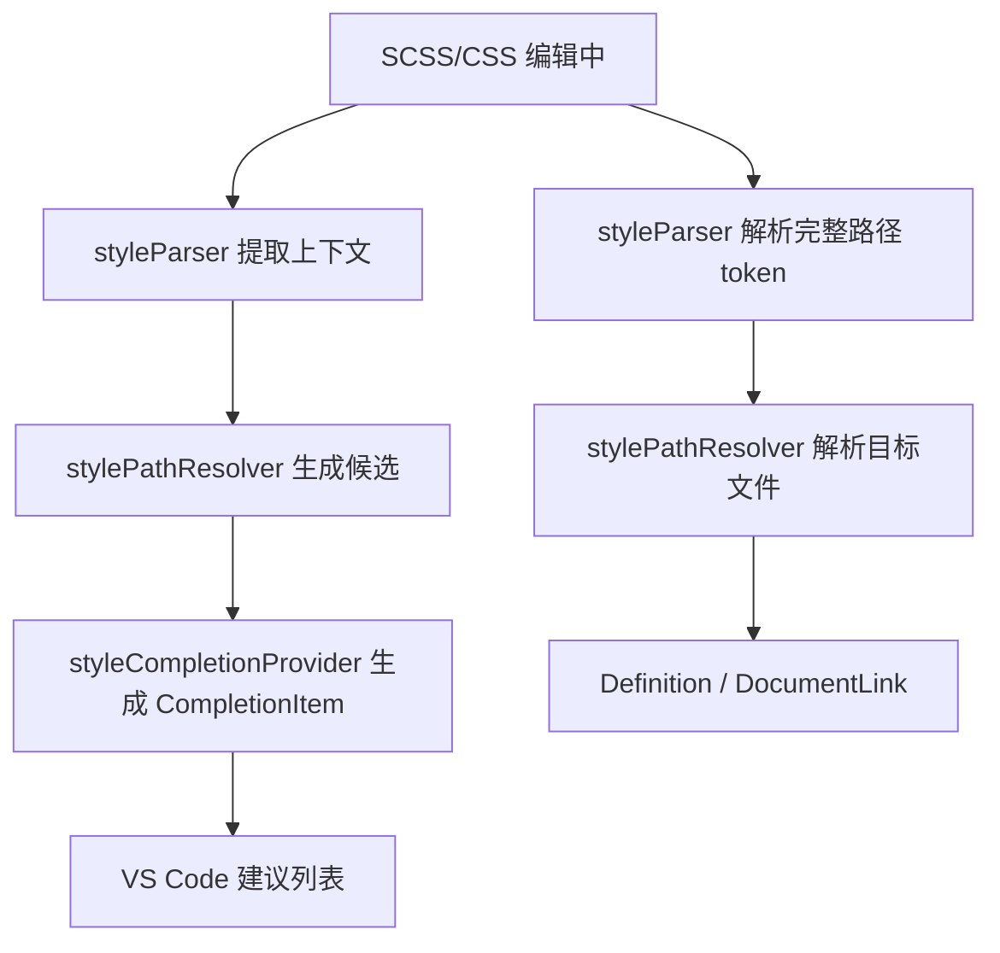

# SCSS/CSS Path IntelliSense

Language:

- 中文：当前文档
- English: [README.md](README.md)

一个面向 `.scss` 和 `.css` 的 VS Code 扩展，提供以下能力：

- 路径跳转（Go to Definition）
- 可点击路径链接（Document Links）
- 基于 `tsconfig/jsconfig` 别名的路径自动补全（类似 path-intellisense）

## 功能概览

| 能力 | 说明 |
| --- | --- |
| 定义跳转 | 在样式路径字符串上使用 `F12` / `Ctrl+Click` 跳到目标文件 |
| 文档链接 | 路径文本渲染为可点击链接，点击直接打开目标文件 |
| 路径补全 | 在输入中的路径（含未闭合字符串）弹出候选并支持插入 |
| 别名解析 | 使用最近 `tsconfig.json` / `jsconfig.json` 的 `baseUrl` + `paths` |

## 支持语法

- `@use "..."`
- `@forward "..."`
- `@import "..."`
- `@import url(...)`
- `url(...)`

自动补全支持“输入中”场景，例如：

```scss
@use "@/comp
@import url(../asse
```

## 快速开始

### 1. 从源码运行（开发调试）

```bash
npm install
npm run compile
```

然后在 VS Code 中运行调试配置 `Run SCSS/CSS Path IntelliSense Extension`。

### 2. 直接使用扩展

安装后打开 `.scss` / `.css` 文件即可自动激活（`onLanguage:scss`、`onLanguage:css`）。

## 配置项

可在 VS Code Settings 中搜索 `scssPathJump` 进行配置。

| 配置项 | 默认值 | 说明 |
| --- | --- | --- |
| `scssPathJump.enableNodeModules` | `true` | 定义跳转时是否尝试解析 `node_modules` 裸包路径 |
| `scssPathJump.enableUrl` | `true` | 是否启用 `url(...)` 的解析与补全 |
| `scssPathJump.enableDocumentLinks` | `true` | 是否启用路径文本的可点击链接 |
| `scssPathJump.enablePathCompletion` | `true` | 是否启用路径自动补全 |
| `scssPathJump.preferExtensionless` | `true` | 补全插入时优先无扩展名（如 `button` 而非 `button.scss`） |
| `scssPathJump.showPartialFiles` | `true` | 补全中显示 Sass partial（例如 `_button.scss`） |
| `scssPathJump.completionMaxEntries` | `200` | 每次补全请求返回的最大候选数（最小值 `20`） |
| `scssPathJump.logLevel` | `error` | 日志级别：`off` / `error` / `debug` |

## 用法

### 定义跳转

1. 在路径字符串上放置光标。
2. 执行 `Go to Definition`（`F12`）或 `Ctrl+Click`。

示例：

```scss
@use "@/styles/theme";
@import "./mixins";
```

### 文档链接

开启 `scssPathJump.enableDocumentLinks` 后，路径会显示为可点击链接。

### 路径自动补全

- 自动触发字符：`/`、`.`、`"`、`'`、`@`
- 手动触发：`Ctrl+Space`

补全候选会根据当前输入前缀进行过滤，并支持目录项连续补全（选择目录后继续弹出候选）。

## 别名配置示例

`tsconfig.json` / `jsconfig.json` 示例：

```json
{
	"compilerOptions": {
		"baseUrl": ".",
		"paths": {
			"@/*": ["src/*"],
			"~styles/*": ["src/styles/*"]
		}
	}
}
```

样式内可直接使用：

```scss
@use "@/styles/theme";
@forward "~styles/mixins";
```

## 解析策略

### 定义跳转 / 文档链接解析顺序

1. 相对路径（`./`、`../`）
2. 工作区根路径（`/xxx`）
3. `tsconfig/jsconfig` 别名映射（`paths`）
4. `baseUrl` 回退
5. Sass 隐式相对路径（非 `@` 前缀）
6. `node_modules`（可选，受 `enableNodeModules` 控制）

### 自动补全候选来源

1. 相对路径目录
2. 工作区根路径目录
3. 别名前缀候选（例如 `@/`）
4. 别名展开后的真实目录
5. `baseUrl` 对应目录
6. Sass 隐式相对目录（非 `@` 前缀）

说明：当前版本的自动补全不扫描 `node_modules` 包目录；`node_modules` 主要用于定义跳转解析。

### 样式候选规则

对于基路径 `foo/bar`，会尝试候选：

- `foo/bar.scss`
- `foo/bar.sass`
- `foo/bar.css`
- `foo/_bar.scss`
- `foo/_bar.sass`
- `foo/bar/index.scss`
- `foo/bar/index.sass`
- `foo/bar/index.css`
- `foo/bar/_index.scss`
- `foo/bar/_index.sass`

## 设计与实现

核心模块：

- `src/extension.ts`
	- 注册 DefinitionProvider、DocumentLinkProvider、CompletionItemProvider
	- 监听配置变化和 `tsconfig/jsconfig` 文件变化，清理缓存
- `src/styleParser.ts`
	- 解析完整 token（跳转/链接使用）
	- 解析不完整输入上下文（补全使用）
- `src/stylePathResolver.ts`
	- 路径解析与候选生成
	- 目录缓存（按目录 `mtime`）
- `src/tsConfigService.ts`
	- 从当前文件向上寻找最近 `tsconfig/jsconfig`
	- 递归解析 `extends` 并合并 `baseUrl/paths`
- `src/styleCompletionProvider.ts`
	- 将候选映射为 VS Code `CompletionItem`
	- 处理排序、过滤、目录连续触发

流程图：



## VSIX 生成与安装

### 1. 生成 VSIX

```bash
npm install
npx @vscode/vsce package
```

成功后会生成类似：

```text
scss-css-path-intellisense-0.0.1.vsix
```

如果提示缺少 `repository` 字段：

```text
WARNING A 'repository' field is missing from the 'package.json' manifest file.
```

可选方案：

1. 推荐：在 `package.json` 补充 `repository` 字段后重新打包
2. 快速打包：

```bash
npx @vscode/vsce package --allow-missing-repository
```

### 2. 安装 VSIX

方式 A（UI）：

1. 打开命令面板
2. 执行 `Extensions: Install from VSIX...`
3. 选择 `.vsix` 文件

方式 B（命令行）：

```bash
code --install-extension ./scss-css-path-intellisense-0.0.1.vsix --force
```

### 3. 版本发布建议

每次重新打包发布前，先更新 `package.json` 的 `version`。

## 开发命令

```bash
npm run compile   # 编译
npm run watch     # 监听编译
npm run lint      # TypeScript noEmit 检查
```

发布前会自动执行：

```bash
npm run vscode:prepublish
```

## 验证建议

建议至少验证以下场景：

1. `@use` / `@forward` / `@import` / `url(...)` 四类语法下的跳转与补全
2. 未闭合输入的补全（如 `@use "@/comp`）
3. `paths` 通配符别名（如 `@/* -> src/*`）
4. 插入策略（无扩展名优先）
5. partial 文件显示策略（`_*.scss`）

## 典型项目目录下的真实操作示例（逐步截图脚本）

### 示例目录结构

```text
my-web-app/
	src/
		styles/
			_tokens.scss
			_mixins.scss
			components/
				_button.scss
				index.scss
			index.scss
		pages/
			home.scss
	tsconfig.json
```

```json
{
	"compilerOptions": {
		"baseUrl": ".",
		"paths": {
			"@/*": ["src/*"]
		}
	}
}
```

### 逐步操作与截图脚本

| 步骤 | 实际操作 | 预期结果 | 建议截图名称 |
| --- | --- | --- | --- |
| 1 | 打开 `src/pages/home.scss` | 文件处于可编辑状态 | `01-open-home-scss.png` |
| 2 | 输入 `@use "@/styles/comp` 并停在行尾 | 自动弹出补全列表 | `02-alias-completion-popup.png` |
| 3 | 在补全中选择 `components/` | 插入目录并继续弹出下一层补全 | `03-directory-chained-completion.png` |
| 4 | 选择 `_button.scss`（或 `button`） | 路径被插入（默认无扩展名优先） | `04-select-partial-item.png` |
| 5 | 将光标放到 `@use "@/styles/components/button"` 路径上按 `F12` | 跳转到目标样式文件 | `05-go-to-definition.png` |
| 6 | `Ctrl+Click` 同一路径 | 可点击链接跳转生效 | `06-document-link-click.png` |
| 7 | 输入 `background: url("@/styles/comp` | `url(...)` 中同样出现补全 | `07-url-completion.png` |
| 8 | 打开设置，切换 `scssPathJump.preferExtensionless=false` | 再次补全时插入带扩展名 | `08-extensionful-insert.png` |
| 9 | 切换 `scssPathJump.showPartialFiles=false` | 补全列表中隐藏 `_*.scss` | `09-hide-partials.png` |
| 10 | 将 `scssPathJump.enablePathCompletion=false` | 自动补全不再触发（手工验证关闭效果） | `10-disable-completion.png` |

### 演示录屏建议（可选）

1. 先录制默认配置下完整路径补全过程（步骤 1-7）。
2. 再录制两个配置切换效果（步骤 8-10）。
3. 结尾回到 `settings.json` 展示最终配置快照，便于复现。

## 已知限制

1. 别名来源仅 `tsconfig.json` / `jsconfig.json`（不包含 Vite/Webpack 自定义别名）
2. 自动补全按“当前行上下文”解析，复杂跨行拼接场景不保证命中
3. 自动补全当前不扫描 `node_modules` 目录
4. `data:` / `http(s):` / `file:` / `mailto:` / `tel:` / `#` / `//` 等路径会被跳过

## 排障

### 看不到补全

1. 确认 `scssPathJump.enablePathCompletion=true`
2. 确认当前语法位置在支持的路径上下文内
3. 手动按 `Ctrl+Space` 触发建议

### 打包日志出现 `Debugger attached`

通常是因为在 JavaScript Debug Terminal 中执行命令，不影响功能，可切换到普通终端执行。

### 打包中断并提示缺少 `repository`

见上文“VSIX 生成与安装”章节，可补 `repository` 或使用 `--allow-missing-repository`。
